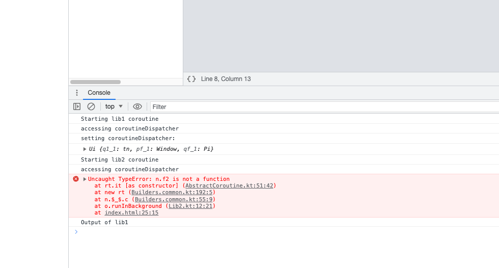

# multiple-js-libs-with-coroutines

## Instructions 

1. Build libraries

    ```shell
    ./gradlew build
    ```
2. Open [webapp/index.html](webapp/index.html)

3. Open console logs in Browser.
    
    See coroutine from `lib1` working and from `lib2` don't working.